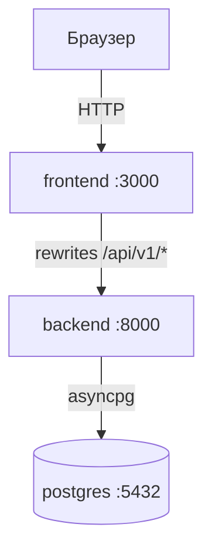
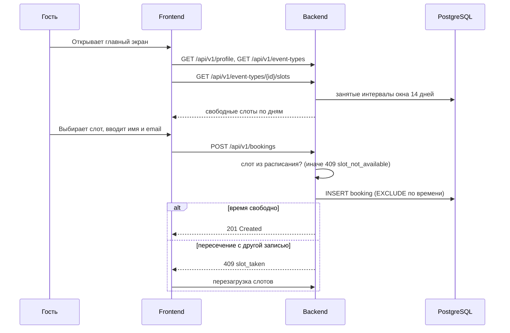

# Архитектура

---

## 1. Компоненты и ответственность

| Компонент | Ответственность | Не отвечает за |
|-----------|-----------------|----------------|
| Frontend (Next.js) | UI, запросы к API, отображение слотов | Расчёт слотов, правила бронирования |
| Backend (FastAPI) | Бизнес-логика, валидация, REST API | Рендеринг UI |
| PostgreSQL | Хранение, гарантия непересечения броней (`EXCLUDE`) | Бизнес-правила |

Бизнес-логика живёт **только в backend**.

---

## 2. Контейнеры

---

## 3. Последовательность: бронирование слота

---

## 4. Деплой

Локально: `docker-compose.yml` поднимает PostgreSQL; backend и frontend запускаются через `make dev`. Продовый деплой — вне scope первых спринтов (см. [roadmap](../roadmap.md)).

---

## 5. Репозиторий и релизы

Монорепо. CI (`.github/workflows/ci.yml`) прогоняет линтеры, типы и тесты на каждый push. `release-please` формирует release-PR по Conventional Commits после мержа в `main`.
