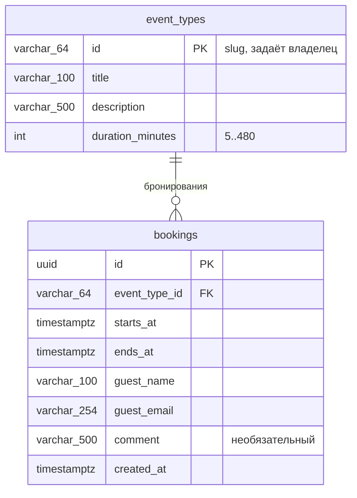

# Модель данных

> **СУБД:** PostgreSQL 18. Все моменты времени — `TIMESTAMPTZ` (UTC). Схему ведёт Alembic: `make migrate`, `make migrate-new m=<название>`; модели — `backend/app/models.py`, миграции — `backend/migrations/versions/`.
> **Ключи:** у типа события — slug, который задаёт владелец; у бронирования — `UUID` ([ADR-001](../decisions/001-tech-stack.md)).

## ER-диаграмма

Рабочее расписание (пояс, дни, часы, запас до записи) — не в БД, а в конфигурации (`OWNER_TIMEZONE`, `WORK_DAYS`, `WORK_START`, `WORK_END`, `BOOKING_MIN_NOTICE_MINUTES`); слоты вычисляются, а не хранятся.

## Ограничения

| Таблица | Ограничение | Зачем |
|---------|-------------|-------|
| `event_types` | `PRIMARY KEY (id)` | Уникальный id; дубликат — `409 event_type_exists` |
| `event_types` | `CHECK (duration_minutes BETWEEN 5 AND 480)` | Допустимая длительность |
| `bookings` | `CHECK (ends_at > starts_at)` | Корректный интервал |
| `bookings` | `EXCLUDE USING gist (tstzrange(starts_at, ends_at, '[)') WITH &&)` (`bookings_no_overlap`) | Никакие два бронирования, даже разных типов, не пересекаются по времени; встык (конец одного = начало другого) допустимо |
| `bookings` | `FOREIGN KEY (event_type_id) REFERENCES event_types(id)` | Бронирование принадлежит существующему типу |

`EXCLUDE` — окончательный арбитр при одновременных запросах: проигравший получает `409 slot_taken`. Alembic autogenerate его не сверяет, поэтому DDL написан в миграции вручную.

## Индексы

- `bookings (starts_at)` — выборка предстоящих встреч и занятого времени окна.
