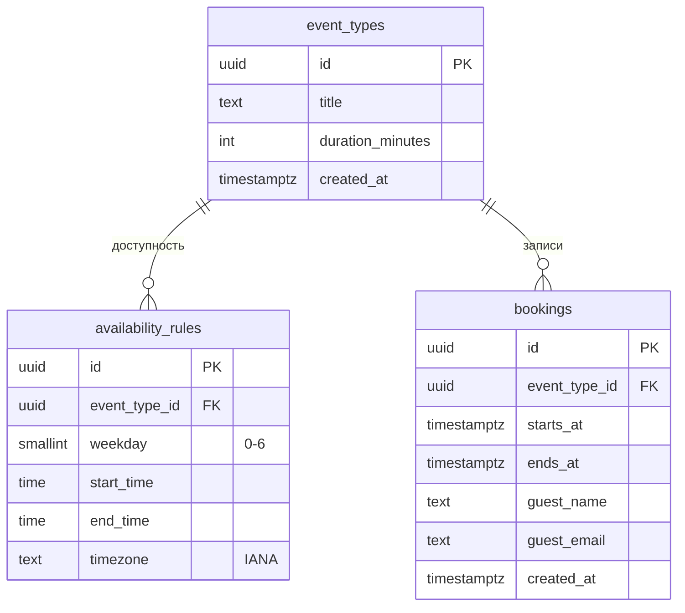

# Модель данных

> **Статус:** предварительная схема. Реализуется в sprint-02; при реализации уточняется.
> **СУБД:** PostgreSQL. **PK:** `UUID` (решение закреплено в [ADR-001](../decisions/001-tech-stack.md)). Все моменты времени — `TIMESTAMPTZ` в UTC.

---

## ER-диаграмма

---

## Ограничения

| Таблица | Ограничение | Зачем |
|---------|-------------|-------|
| `event_types` | `duration_minutes > 0` | Валидная длительность |
| `availability_rules` | `start_time < end_time`, `weekday BETWEEN 0 AND 6` | Корректный интервал |
| `bookings` | `UNIQUE (event_type_id, starts_at)` | Исключает двойное бронирование |

> Если типы звонков смогут пересекаться по времени владельца, уникальность переносится на уровень владельца (`EXCLUDE USING gist` по диапазону) — решение в sprint-02.

## Индексы

- `bookings (starts_at)` — выборка предстоящих записей и занятых слотов за дату.
- `availability_rules (event_type_id)` — FK.
