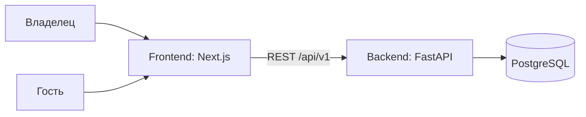

# Техническое видение проекта

> **Исторический документ** (исходное видение). Актуальные термины — в [GLOSSARY.md](../../GLOSSARY.md), актуальный контракт — [api-contracts.md](api-contracts.md) и TypeSpec в `api/`, схема данных — [data-model.md](data-model.md). Сущность `AvailabilityRule` не реализована: расписание задаётся конфигурацией.

---

## 1. Система в целом

«Запись на звонок» — веб-приложение из двух процессов: backend (FastAPI), владеющий бизнес-логикой и данными в PostgreSQL, и frontend (Next.js), отображающий публичную страницу бронирования и страницу владельца. Ядро — расчёт свободных слотов и атомарное создание записи.

---

## 2. Роли

| Роль | Описание |
|------|----------|
| **Владелец** | Настраивает типы звонков и доступность, видит записи. Без авторизации (MVP: единственный владелец, страница владельца не защищена) |
| **Гость** | Анонимный посетитель; выбирает слот и записывается |

---

## 3. Пользовательские сценарии

### Владелец
- **В-1: Настроить тип звонка** — название, длительность.
- **В-2: Задать доступность** — дни недели и часы приёма.
- **В-3: Посмотреть записи** — список предстоящих встреч.

### Гость
- **Г-1: Выбрать слот** — тип звонка → дата → свободное время.
- **Г-2: Записаться** — имя + email, подтверждение.
- **Г-3: Получить отказ на занятый слот** — понятная ошибка 409.

---

## 4. Архитектура (high-level)



Детали — в [architecture.md](architecture.md).

---

## 5. Компоненты системы

### Backend
- Расчёт слотов, создание записей, валидация, REST API.
- Не рендерит UI, не хранит состояние вне БД.
- **Статус:** каркас (sprint-01), `/health`.

### Frontend
- Публичная страница бронирования и страница владельца.
- Не содержит бизнес-правил (расчёт слотов — на backend).
- **Статус:** каркас (sprint-01), заглушка главной.

### База данных
- PostgreSQL; схема через Alembic.
- **Статус:** планируется (sprint-02); локально — `docker-compose.yml`.

---

## 6. Структура проекта

```
.
├── backend/        # FastAPI, uv, ruff, mypy, pytest
├── frontend/       # Next.js, Tailwind 4, shadcn/ui, Vitest
├── docs/           # концепт, roadmap, спринты, ADR
├── AGENTS.md       # инструкции для агентов и разработчиков
├── .github/        # CI, release-please, hexlet-check
└── Makefile        # единая точка входа
```

---

## 7. Доменные сущности

Детализация — в [data-model.md](data-model.md).

| Сущность | Смысл |
|----------|-------|
| EventType | Тип звонка: название, длительность |
| AvailabilityRule | Правило доступности: день недели + интервал времени |
| Booking | Запись гостя на конкретный слот |

---

## 8. Технологический стек

Полностью — [ADR-001](../adr/001-tech-stack.md).

- **Backend:** Python 3.12, uv, FastAPI + uvicorn, SQLAlchemy 2 async, Alembic, asyncpg, Pydantic v2, ruff (`ALL`), mypy strict, pytest + pytest-asyncio + httpx.
- **Frontend:** Next.js (App Router), React, TypeScript strict, Tailwind 4, shadcn/ui, pnpm, ESLint + Prettier, Vitest + Testing Library.
- **БД:** PostgreSQL.
- **CI/CD:** GitHub Actions, release-please.

---

## 9. Принципы

- KISS / YAGNI: только то, что нужно для брони слота.
- Время хранится в UTC (`TIMESTAMPTZ`), часовой пояс владельца — атрибут правила доступности.
- Двойное бронирование исключается ограничением в БД, а не только проверкой в коде.
- Все команды — через `make`; секреты — только в `.env`.
- Conventional Commits + squash merge (нужно для release-please).

---

## 10. Не входит в проект

Авторизация, личные кабинеты, интеграции с внешними календарями, уведомления по email, оплата, несколько владельцев.
